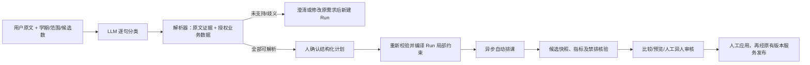

# AI 走班排课 Agent：当前代码实现与业务闭环

> 本文是当前代码的**现状说明**，供业务与 GPT Codex 评审，不是“任意自然语言规则均已支持”的承诺。目标架构和历史实施规划见 [产品与技术实施规范](copilot-ai-scheduling-agent-production-design.md)。本文中的“规则”分为用户原话、经确认的结构化规则、求解器约束三个层次；三者不可混为一谈。

## 1. 职责与边界

新入口是 `Chronos-UI/src/modules/education/pages/AdminSchedulingAi.vue` 和 `SchedulingAiRunController`。教务人员选择学期、`GLOBAL`（全量）或 `LOCAL`（指定教学任务）、输入自然语言及 1–5 个候选数量（默认 3）。新 Agent **只生成候选，不直接应用、审批或发布课表**。输入中的学期和范围必须与表单参数及当前授权数据一致；模型不能改变表单指定的学期、模式、教学任务或候选数。

这是一条**受控流程**，而不是模型能自行发现任意业务规则、选择任意 Tool 并执行的自治 Agent：LLM 负责给原文子句建议分类；服务端负责实际实体识别、语义核对、约束编译和执行顺序；自动排课器负责求可行位置和评分；人负责确认、候选审核、应用和发布。模型不生成课表或可信业务 ID。

主要入口：`SchedulingAiRunService` 管理 Run；`SchedulingAiModelClassifier` 和 `SchedulingAiRequirementParser` 处理需求；`SchedulingAgentPlanValidator` 编译规则；`SchedulingAgentCapabilities` 定义受控 Skill/Tool；`ScheduleGenerationJobService` 承载异步任务；`AutoSchedulingService` 生成候选；`SchedulePlanVersionService` 负责正式发布。

## 2. 自然语言怎样变成可执行规则

1. `SchedulingAiRunRequest` 校验学期、模式、选中教学任务、请求文本和候选数。`SchedulingAiModelClassifier` 把文本按中英文标点/换行分成最多 30 个非空子句；提示词就在此类的 `INSTRUCTIONS`。通过 `AiModelChatService.chatStructured` 使用 `schedule.requirement.clauses.v1` schema 调用已配置的默认模型。响应须为 JSON，按顺序**逐字对应每个原子句**；漏句、加句、额外字段或非法分类报错，指定格式/漏句可有限重试，不能默默丢弃规则。结构化输出当前是严格 JSON 校验，并非模型生成任意规则 DSL。
2. 模型只可分类为 `TEACHER_SLOT`、`OFFERING_BLOCK`、`WEEK_RULE`、`LOCK_ENTRY`、`TEACHER_PRIORITY`、`SLOT_RULE`、`GENERATION` 或 `UNSUPPORTED`。仅 `SLOT_RULE` 可附 `subject/reference/action/days/periods`，其中动作只允许 `FORBID`，对象为单教师、单教学任务或“全体教师”。这些字段都是**待核验的建议**，不是执行指令。
3. `SchedulingAiRequirementParser` 按分类以确定性表达式、原文证据、数据库实体及权限解析。教师按姓名/工号、教学任务按课程/任务在**学期及本轮范围内**解析；重复姓名或不唯一的教学任务要求澄清。上午/下午等教师时段依校区作息展开。`SLOT_RULE` 的星期、节次必须在原话中明确且与模型数组完全相符，不接受范围、例外、推测或混用软/硬语义；多星期 × 多节次展开，最多 200 条。全体教师仅指本轮目标教学任务的教师，且逐位核对权限与在用状态，不等于数据库里所有教师。
4. 解析结果 `SchedulingAiPlan` 包含原文关联的规则、`clarifications`、`unsupported` 和 `unresolvedClauses`。三者任何一项非空都不能确认。可澄清的子句需用完整新规则回复，版本随之更新；不支持的原需求以及学期/模式冲突必须修改原文、**新建 Run**，不能靠回复跳过。未被识别的子句不会被悄悄删掉。
5. 用户确认当前版本时，`SchedulingAgentPlanValidator` 重读授权学期、作息、教师、教学任务和课表项，校验来源文字、范围、重复、冲突和展开覆盖，构造 `AutoScheduleCommand` 及不可变的 `ScheduleRunConstraints`。生成前再次验证；规则通过后随异步任务请求保存为本轮快照，不写入学校正式教师时间约束、教学任务字段或课表锁课标记。普通排课入口调用 `ScheduleRunConstraints.empty()`，不会继承本轮局部规则。

**目前识别/执行矩阵**（示例均须包含能唯一定位的实际对象和有效范围；例句不是完整语法承诺）：

| 原话示例 / 分类 | 服务端核验与编译 | 求解器实际语义 |
| --- | --- | --- |
| “张老师周二第 3 节不能上课” / `TEACHER_SLOT` | 唯一教师、星期和节次；也支持能由作息确定的上午/下午；编成 `TeacherSlot(FORBIDDEN)` | 本轮该教师时段不可排；`PREFERRED` 变为偏好奖励而非保证 |
| “PLC 实训尽量连堂” / `OFFERING_BLOCK` | 课程名称精确匹配、范围内教学任务、周课时不少于 2；编成 `OfferingDuration(2)` | 优先放两节连续课；放不下时可回退单节，属于偏好，**不保证全部连堂** |
| “某唯一课程单周上课 / 第 2 到 10 周上课” / `WEEK_RULE` | 周型、起止周和唯一教学任务与学期核对；编成 `WeekRule` | 条目的授课周范围按指定周型生成；周冲突按实际授课周交集计算 |
| “保留现有课表项 ID …” / `LOCK_ENTRY` | 现存、未取消且属于本轮教学任务的具体条目；编成 `LockedEntry` | 当前候选保留该条目，不改正式表的 `locked` 字段 |
| “张老师尽量少跨校区 / 少空档 / 同日集中” / `TEACHER_PRIORITY` | 唯一授权教师及已定义偏好种类；编成 `SoftPriority` | 影响该教师位置惩罚/奖励，不作为硬约束 |
| “张老师周二、周四第 3、4 节不能排” / `SLOT_RULE` | 原文逐项可验证的日与节；对象为唯一教师、唯一教学任务或本轮全体教师；编成各个 `SlotExclusion` | 每个时段跳过匹配对象，连堂覆盖任一禁排节次也跳过；最终逐条统计违规 |
| “生成 3 个方案” / `GENERATION` | 仅纯生成指令；数量仍以请求字段为准 | 不增加求解约束 |
| 无法完整对应上述模式 / `UNSUPPORTED` | 明确展示原因、阻止确认 | **不执行**，不能宣称满足 |

例如“排出所有周末、节假日、考试安排；所有老师不得连堂；公共课、合班课默认两节连堂”**不在当前可执行规则集合**。周末指定星期节次禁排可落入 `SLOT_RULE`，但节假日/考试为日期级、全体教师不得连堂为全局连续授课上限、公共/合班课默认两节连堂为群组筛选及例外优先级，不能靠当前分类或删除任务等价实现。排课器已有教师日/周课时、连续课时的配置上限，但没有从这段自然语言创建通用的新上限规则。

## 3. 数据来源、Tool 与权限

`SchedulingAgentCatalogService` 提供按授权过滤的学期、年级、班级、教师、教室、课程、教学任务及作息节次分页查询和唯一实体解析；`SchedulingAgentCapabilities` 注册需求、约束、生成、比较等 Skill，以及只读 `CONTEXT`/`RESOLVE`/状态/对比/预览、验证与生成提交 Tool。Tool 限定输入类型、Run、登录身份、权限、状态和调用预算，写操作只允许在确认后提交生成。创建 Run 时实际调用受控学期目录查询；当前需求解析器也会直接查询受授权范围限制的仓储，**并非 LLM 自主逐项选取 Tool、观察结果再规划**。这些目录是业务事实接口，不是自然语言规则知识库。

`SchedulingAiRunController` 要求 AI Agent 使用、排课管理及相应 AI 使用/确认权限和完整排课数据范围；普通用户不能靠模型声明扩权。Run 限负责人或具备运维权限者可见，确认和生成只允许负责人。每轮记录版本、请求幂等键、已解析和已确认计划、任务 ID 及 Tool 步骤；相同 `clientRequestId` 不允许对应另一份请求。

## 4. 求解器如何形成候选

`SchedulingAgentPlanValidator` 把 `GLOBAL/LOCAL` 映射成自动排课的 `FULL/LOCAL`，依据学期作息生成可排星期、每日节次和结束教学周。`AutoSchedulingService.generate` 获取学期有效教学任务、现有课表（基线）、正式教师时段约束、教师负荷设置、教学班已选学生、可用教室与不可用时段、作息及排课策略，并给当前基线计算哈希。LOCAL 只重排指定任务；其余任务、已锁课、已取消历史条目和本轮临时保留条目作为保留基线占位，不能通过排除必排任务假装规则已满足。

算法是**带硬过滤与软评分的贪心逐课时放置**，不是 LLM 推理出课表，也不是通用 CP-SAT/数学规划器：

1. 目标任务按学生数、周课时等顺序处理；扣除保留课时后，为每节/连堂块枚举允许的星期、起始节次及启用的教室。每个候选序号旋转枚举时段的起点以产生变化；最多生成请求数量（1–5）份快照，不保证互不相同，也不保证全局最优。
2. 硬过滤：本轮和正式教师禁排、`SlotExclusion`、教室容量/类型/设备/校区、教室不可用、真实作息可排节次、教师日/周/连续课时上限和校区通行间隔；索引检查同授课周的教室、教学任务、教师、已选学生占用冲突。连堂需覆盖的每节都可用。有效教学周及锁定项要一致。
3. 在可行位置中以同课程同日重复、教师日负荷、连续负荷、跨校区和空档惩罚，及教师偏好奖励、本轮软偏好修正，选择当前代价最小的位置。最终 `totalScore` 按已排课时奖励、偏好命中、各惩罚及未排课时惩罚计算。评分用于比较，不是可行性证明；有本轮教师软偏好时返回列表先按未排课时升序，再按总分降序，否则按总分降序。
4. 位置不存在时增加 `unscheduledLessons`，不删教学任务。生成的 `ScheduleCandidatePlan` 保存课表快照、范围、基线哈希和指标，包括 `scheduledLessons`、`unscheduledLessons`、软目标相关计数及 `slotRuleChecks`。每条组合禁排规则在**完整候选**中数违规；含保留基线冲突即报错，当前候选不能伪报通过。但其他未排完课时仍可能存在，必须明示，不可将零违规等同于“所有要求满足”。

`ScheduleGenerationJobService` 将确认的命令和局部约束作为请求快照，事务提交后异步执行、记录进度、支持取消，并用租约/所有者限制过期任务写回；任务失败会进入 `FAILED`，不会把异常当作候选成功。候选只用于比较（同一学期 2–5 份）、相对当前课表的只读差异预览与解释。静态说明来自候选实际指标；额外按需模型解释只能排序服务端提供的指标代码，数值和文案仍来自服务端，模型失败即明确报错。

## 5. 状态与人工闭环

Run 依据解析结果进入 `NEEDS_CLARIFICATION` 或 `READY_FOR_CONFIRMATION`。用户补齐可澄清子句后重解析、更新版本；确认时版本和原文均重新核验，状态进入 `CONFIRMED`；生成提交进入 `QUEUED`，按任务同步为 `RUNNING`、`CANDIDATES_READY`、`FAILED` 或 `CANCELLED`。未关联任务的未完成 Run 到期可变为 `EXPIRED`；不能越过确认直接生成或在失败的旧 Run 上无条件重试。

候选起始为 `DRAFT`；负责人提交审核为 `SUBMITTED`，另一位用户审批为 `APPROVED` 或 `REJECTED`。只有 `APPROVED`、未排课时为 0、且当前课表的哈希仍与生成时一致，`AutoSchedulingService.apply` 才能将候选快照写入正式课表（`APPLIED`）；基线改变则要求重新生成。**应用不等于发布**：人工再经 `SchedulePlanVersionService.publish` 校验考试资源可用性、发布级质量硬风险，生成正式课表版本和通知。Agent Tool 和 AI Run API 均不暴露审核、应用、发布或回滚。

旧菜单 `AdminEducationAgents.vue` 中的 `Scheduling Agent` 是另一条流程：`EducationAgentService.propose` 用正则抽取单教师、单星期、单节次并存 `SchedulingAgentProposal.DRAFT`，`confirm` 把 `FORBIDDEN/PREFERRED` 写入正式 `TeacherTimeConstraint`，从而影响**普通排课及后续排课**。新 AI Run 的规则只在该轮任务内生效；两者共用部分业务数据，但**尚未共用规则定义、语义编译或草稿确认**，旧菜单草稿不能直接充当新 Run 的约束输入。若未来整合，必须先确定确认后的生效范围（仅本轮/学期全局）、适用对象及冲突/优先级，不能把旧草稿确认当作新 Run 确认。

## 6. 验证证据与评审重点

`Chronos/education-app/src/test/java/com/chronos/SchedulingAiBusinessAcceptanceTests.java` 提供**显式启用**的真实模型加可销毁 PostgreSQL 测试（须同时开启 `CHRONOS_ACCEPTANCE_CLONE=true`、`CHRONOS_AI_BUSINESS_ACCEPTANCE=true`，数据库名含 `test` 或 `verify`）。已在现有业务库的隔离副本跑通自然语言输入、确认、生成两候选、逐条禁排核验、对比预览、异人审核、应用和发布，并确认普通排课不继承 Run 局部禁排；原业务库未写入。此证据覆盖**当前受限规则切片**，不等于所有学校场景或任意规则的生产验收。

供后续设计评审的关键缺口：

- **规则知识与语义**：建立有版本、适用对象、时间粒度、强度、优先级、例外、依赖业务数据的规则原语/规则目录；日期级节假日、考试与每周课表的关系必须先定义，不能仅用星期节次代替。
- **数据查询与编排**：针对新原语开放最小权限的事实 Tool，确定要查哪张权威业务表及缺失数据如何澄清；现有 Tool 白名单不是 LLM 自主规划/调用循环。旧 Agent 的全局草稿需要独立的迁移/转换与人工范围确认。
- **求解与冲突**：把每种硬规则明确编译到位置搜索及保留基线核验，把软目标编译进评分；有互相矛盾的硬规则或课时排不完时，提供可追溯的不可行原因，而不是默默删课、降级硬约束或只给高分方案。
- **逐条验收**：当前 `slotRuleChecks` 逐项核验组合禁排，其他规则尚无统一的“原话 → 约束 → 命中/违规 → 未排课原因”证明清单；每新增一种语义都需要对应求解、结果核验、边界及真实业务测试。

因此，“识别规则 → 查询约束针对的基础数据 → 排除非法位置 → 求解并核验”是合理方向，但**仅靠模型识别与数据筛选不能支持任意自然语言的走班排课**。必须先定义可执行语义及数据来源，再逐种扩展求解器和验收器；未知或无法证明满足的规则继续阻止确认。
